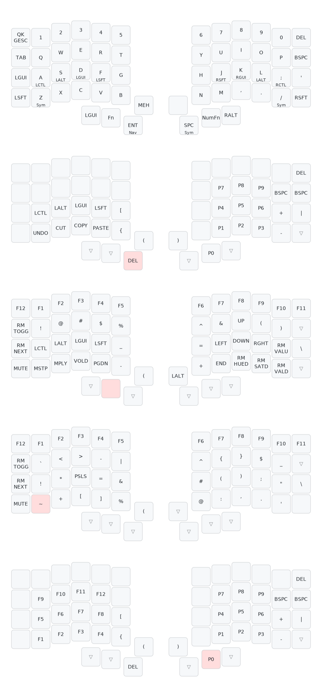

# QMK Userspace — apclark31

QMK external userspace for my custom keyboard keymaps. Firmware is automatically compiled via GitHub Actions on every push — download the `.uf2` from [Releases](../../releases).

## Keyboards

| Board | Revision | Keymap | Firmware |
|-------|----------|--------|----------|
| Keebio Iris | Rev 8 (RP2040) | `apclark31` | `.uf2` |

## Keymap Overview

**6 layers** with QWERTY base (Mac + Win), home row mods (GASC), macros, and ZMK-style ASCII art formatting.

| Layer | Activation | Purpose |
|-------|------------|---------|
| Base (0) | Default | QWERTY + home row mods (macOS) |
| Win (1) | MEH+ESC combo | Sparse overlay -- swaps GUI/Ctrl for Windows |
| Nav (2) | Hold Enter | Numpad (right) + editing (left) |
| Fn (3) | Hold MO(3) | Macros (CK_PASS, M2-M5) + symbols + arrows + RGB |
| Sym (4) | Hold Space / Z / / | Symbols |
| NumFn (5) | Hold MO(5) | F-keys (left) + numpad (right) |

**Home Row Mods:** A=LCTL, S=LALT, D=LGUI, F=LSFT | J=RSFT, K=RGUI, L=LALT, ;=RCTL

Uses QMK's native `CHORDAL_HOLD` for tap-hold refinement (bilateral combinations rule).



## Flashing

1. Download the latest `.uf2` from [Releases](../../releases)
2. Double-tap the reset button on the Iris PCB — it mounts as a USB drive
3. Drag the `.uf2` onto the drive
4. Flash each half separately (the side plugged into USB is the one being flashed)

## Local Build

If you have the QMK build environment set up locally:

```bash
qmk compile -kb keebio/iris/rev8 -km apclark31
qmk flash -kb keebio/iris/rev8 -km apclark31
```

## Project Status

Active development — planning docs are in the local `~/keyboards/` workspace.

## Related

- [Sofle V2 (ZMK)](https://github.com/apclark31/sofle-v2) — my other split keyboard
- [QMK External Userspace Docs](https://docs.qmk.fm/newbs_external_userspace)
